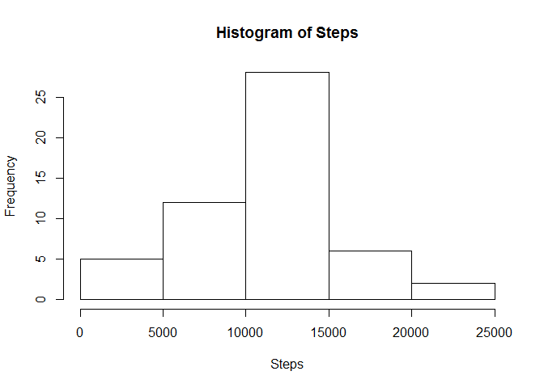
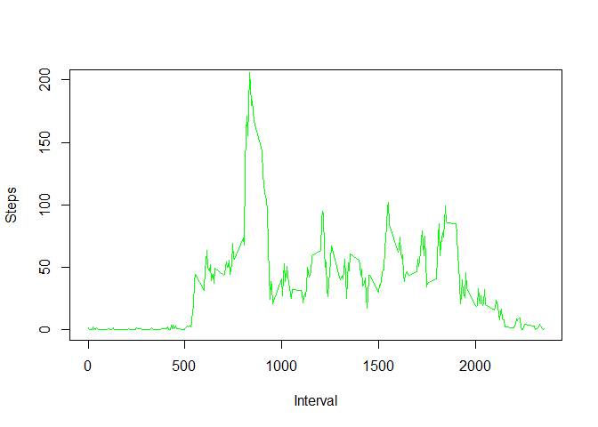
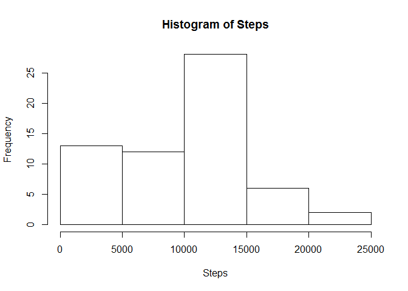
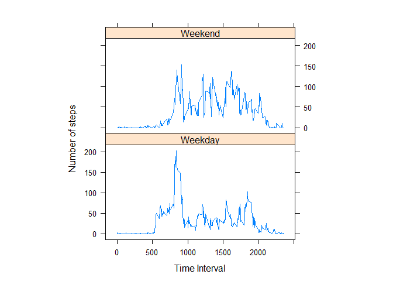

# PA1.Rmd
Jeremiah M. Faries  
Saturday, February 07, 2015  
setwd("D:/DATA SCIENCE/REPRODUCIBLE DATA")


##Loading and preprocessing the data  

Read in the data file which is a 3 column file with the following structure:  
 - COLUMN 1:  number of steps  
 - COLUMN 2:  date(ymd)  
 - COLUMN 3:  interval ?  


```r
fulldat<- read.csv("activity.csv")
dat<-na.omit(fulldat)
```
  
Aggregate the data to compile the steps per day (ignore NA values)

```r
daystep <-aggregate(dat$steps, by=list(dat$date), FUN=sum)
colnames(daystep) <- c("Date", "Steps")
```

##What is the mean total number of steps taken per day?
  
Calculate the mean number of steps and the median number of steps per day

```r
meansteps <- mean(daystep$Steps)
medsteps <- median(daystep$Steps)

cat("The Mean number of steps per day is", meansteps, ",and the Median number of steps is", medsteps)
```

```
## The Mean number of steps per day is 10766.19 ,and the Median number of steps is 10765
```
  
Now we will create a simple histogram of the number of steps taken per day over the 2 months of the data collection period.  

```r
with(daystep, {
hist(Steps)
})
```

 

##What is the average daily activity pattern? 
  
Make a time series plot of the 5-minute interval and the average number of steps taken

```r
intdat <-aggregate(dat$steps, by=list(dat$interval), FUN=mean)
colnames(intdat) <- c("Interval", "Steps")
with(intdat, {
plot(Interval, Steps, type =  "l", ylim = c(0, 200), col = "green")
})
```

 
  
Calculate the 5 minute interval that has the highest average activity across all days

```r
maxinterval <- subset(intdat, intdat[,2] == max(intdat[,2]))[,1]

cat("The 5-minute interval, averaging across all the days, that contains the maximum number of steps is", maxinterval)
```

```
## The 5-minute interval, averaging across all the days, that contains the maximum number of steps is 835
```
##Imputing missing values
  
First, calculate the number of rows with missing data

```r
missing <- is.na(fulldat)
missingrows <- length(missing[missing==TRUE])
cat("There are a total of", missingrows, "rows with NA values")
```

```
## There are a total of 2304 rows with NA values
```
  
To fill the missing values we substitute the average (median in this case) for the day  
First we calculate the mean for each day then we replace all the NA values for the mean for that day. 

```r
#first calculate the mean for each day (if all NA then = 0)
dayav <-aggregate(fulldat$steps, by=list(fulldat$date), FUN=mean)
dayav[is.na(dayav)] <-0
colnames(dayav) <- c("Date", "Mean")

#try a for loop for now to replace all NA values with the mean for that day

for (n in 1:nrow(fulldat)) {
        if (is.na(fulldat[n,1])) {
                thisdate <-  as.character(fulldat[n,2])
                newval <- subset(dayav, as.character(dayav[,1]) == thisdate)[1,2]
                fulldat[n,1] <- newval        
        }
}
```
  
Aggregate the data to compile the steps per day (NA values are equal to mean for the day)

```r
daystep2 <-aggregate(fulldat$steps, by=list(fulldat$date), FUN=sum)
colnames(daystep2) <- c("Date", "Steps")
```
  
Now we will create a simple histogram of the number of steps taken per day over the 2 months of the data collection period.  

```r
with(daystep2, {
hist(Steps)
})
```

 


Calculate the mean number of steps and the median number of steps per day

```r
meansteps2 <- mean(daystep2$Steps)
medsteps2 <- median(daystep2$Steps)

cat("The Mean number of steps per day with missing data filled is", meansteps2, ",and the Median is", medsteps2,           
"\nThe Mean number of steps per day ignoring NA's is", meansteps, ",and the Median is", medsteps)
```

```
## The Mean number of steps per day with missing data filled is 9354.23 ,and the Median is 10395 
## The Mean number of steps per day ignoring NA's is 10766.19 ,and the Median is 10765
```

By filling in missing values with the mean for the day we see the mean and the median are lower, but the mean has diminished more.  Looking at the graph it seems as if this difference is owing to higher frequency of days with a small number of steps for the set with filled in missing values.  


##Are there differences in activity patterns between weekdays and weekends?  

Finally, we add a column to our dataset as a factor to select weekdays versus weekends

```r
days <- weekdays(as.Date(as.character(fulldat$date, format="%y-%m-%d")))

fulldat <- cbind(fulldat, days)
```

Create a function "weekfun" to convert the days to factor to "weekday" or "weekend" and call sapply to the day name to weekday category

```r
weekfun <- function(a) {
  if((a == "Sunday") || (a == "Saturday")) "Weekend"
  
  else "Weekday"
}

fulldat$days <- sapply(fulldat$days, (weekfun))

# aggregate the data to run the time series graph of average steps/daytype/time interval

mw <- aggregate(fulldat$steps, list(fulldat$interval, fulldat$days),mean)
colnames(mw) <- c("interval", "days", "steps")
```

Finally we construct a panel plot using lattice to create a time series presentation of 5 minute interval frequency of steps taken for weekend versus weekday

```r
library(lattice)
     xyplot(steps ~ interval | days, data = mw, type = "l",
            xlab = "Time Interval",
            ylab = "Number of steps",
            layout = c(1,2), aspect =.5)            
```

 

